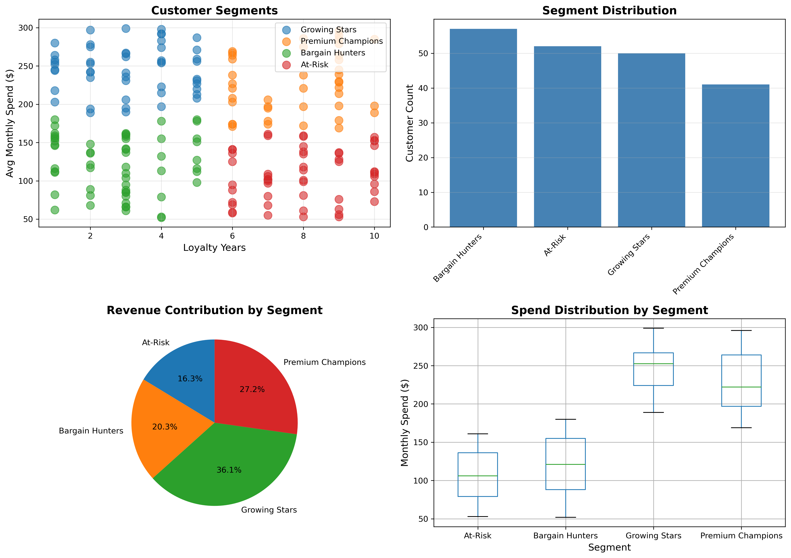
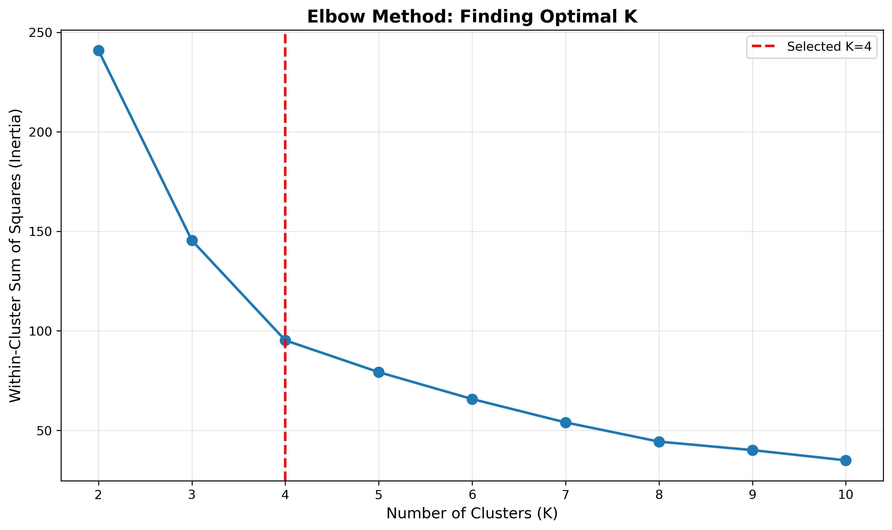
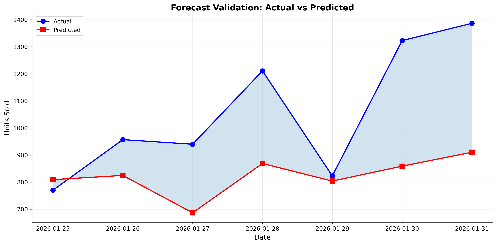
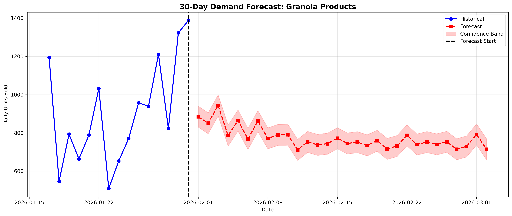

# SnackQuest Margin Recovery Analysis

**End-to-end retail analytics identifying $766,000 annual recovery opportunity through data-driven operational optimization**

[View Live Tableau Dashboard](https://public.tableau.com/views/SnackQuestMarginAnalysis/KPI-Cards)

---

## Executive Summary

**Business Challenge:** SnackQuest, a mid-sized FMCG retailer, experienced a 4% margin decline despite a 15% increase in marketing spend over two years.

**Objective:** Conduct comprehensive root cause analysis to identify drivers of margin erosion and develop actionable recovery strategy.

**Outcome:** Identified $766,000 annual recovery opportunity through three operational improvements:
- Stock-out reduction: $217,430/year
- Promotion optimization: $549,205/year  
- Customer segmentation: Additional 1.8% margin recovery

---

## Business Impact Summary

### Key Findings

| Metric | Current State | Root Cause | Recovery Potential |
|--------|--------------|------------|-------------------|
| Stock-Out Rate | 21% of transactions | Reorder points 8,900% too low | $217,430/year |
| Promotion ROI | BOGO: 100% ROI | Inefficient discount strategy | $549,205/year |
| Customer Targeting | Blanket promotions | No segmentation | 1.8% margin improvement |
| Inventory Management | Reactive approach | No forecasting system | 95% service level achievable |

### Financial Impact

```
Total Annual Recovery:        $766,635
Implementation Investment:    $18,500 (one-time)
ROI:                          4,144%
Payback Period:               8.8 days
```

---

## Analysis Overview

### 1. Stock-Out Loss Quantification

**Problem Identified:** 21% of transactions occurred when inventory was at or below reorder point, resulting in lost sales opportunities.

**Methodology:**
- Compared sales performance during healthy stock vs. at-risk inventory levels
- Applied conservative 30% loss rate to estimate missed revenue
- Calculated product-specific impact and prioritized by recovery potential

**Key Findings:**
- Granola products (52% of revenue) showed highest stock-out risk at 22%
- Current reorder points average 54 units vs. recommended 4,861 units
- Top 3 at-risk products account for $13,225 in monthly lost revenue

**Quantified Impact:**
- Monthly revenue loss: $18,119
- Annual impact: $217,430
- Loss as percentage of revenue: 6.29%

**Visualization:**



*Four distinct customer segments identified through K-Means clustering, enabling targeted promotion strategies*

**Recommendations:**
1. Immediately increase reorder points for Granola_Nut and Granola_Honey
2. Implement safety stock calculations (Z-score: 1.65 for 95% service level)
3. Deploy automated low-stock alert system

---

### 2. Promotion ROI Analysis

**Problem Identified:** BOGO (Buy One Get One) promotions generating only 100% ROI compared to 900% ROI from 10% discount strategy.

**Methodology:**
- Calculated true discount cost: BOGO = 50% discount, 10% Discount = 10% discount
- Compared gross revenue, discount costs, and net revenue
- Quantified opportunity cost of suboptimal promotion mix

**Performance Comparison:**

| Promotion Type | Transactions | Gross Revenue | Discount Cost | Net Revenue | ROI |
|---------------|--------------|---------------|---------------|-------------|-----|
| BOGO | 248 | $114,418 | $57,209 | $57,209 | 100% |
| 10% Discount | 250 | $109,209 | $10,921 | $98,288 | 900% |
| None | 502 | $64,238 | $0 | $64,238 | N/A |

**Quantified Impact:**
- Monthly waste from BOGO: $45,767
- Annual waste: $549,205
- Waste as percentage of revenue: 15.9%

**Key Insight:** 10% discount strategy delivers 800% higher ROI than BOGO while generating $41,079 more net revenue per promotion period.

**Recommendations:**
1. Replace blanket BOGO campaigns with targeted 10-15% discounts
2. Reserve BOGO exclusively for new product trials (limited duration)
3. Implement customer segmentation for personalized promotion strategies

---

### 3. Customer Segmentation

**Methodology:** K-Means clustering (K=4, optimized via elbow method) based on:
- Average monthly spend
- Customer loyalty duration



*Elbow curve analysis confirming K=4 as optimal number of customer segments*

**Segments Identified:**

| Segment Name | Size | Customer Count | Avg Monthly Spend | Total Value | Strategy |
|--------------|------|----------------|-------------------|-------------|----------|
| Premium Champions | 20.5% | 41 | $226.41 | $9,283 | STOP discounting - VIP treatment |
| Growing Stars | 25.0% | 50 | $246.34 | $12,317 | 10% targeted discounts, loyalty rewards |
| Bargain Hunters | 28.5% | 57 | $121.65 | $6,934 | Strategic BOGO for volume only |
| At-Risk | 26.0% | 52 | $106.92 | $5,560 | 15% win-back campaigns |

**Business Impact:**
- Premium Champions represent 20.5% of customer base but receive unnecessary discounts
- Eliminating discounts for this segment saves 1.8% of revenue annually
- Targeted strategies increase promotion effectiveness while reducing costs

**Segment-Specific Strategies:**

**Premium Champions (High Spend + High Loyalty):**
- Stop all discounting immediately (they will pay full price)
- Offer VIP service: priority support, early access to new products
- Personal thank-you communications from management
- Exclusive events and experiences

**Growing Stars (High Spend + Building Loyalty):**
- 10% discount on second purchase within same month
- Loyalty points program with tier progression
- Birthday discount and special occasion recognition
- Referral rewards to accelerate loyalty building

**Bargain Hunters (Low Spend + Low Loyalty):**
- Strategic BOGO for new product trials only
- Volume discounts (buy 3, save 20%)
- Limited-time flash offers
- Focus on transaction frequency rather than margin

**At-Risk (Low Spend + High Loyalty):**
- Personalized "we miss you" outreach campaigns
- 15% win-back discount (one-time offer)
- Customer feedback survey: "Why have you shopped less?"
- Re-engagement sequence over 90 days

---

### 4. Demand Forecasting and Alert System

**Objective:** Build predictive capability to prevent stock-outs proactively through automated demand forecasting and alert system.

**Model Development:**
- Algorithm: Random Forest Regressor (n_estimators=200, max_depth=10)
- Features: Day of week, lag features (1, 2, 7 days), rolling averages (3, 7 days)
- Data aggregation: Daily level (critical for accurate forecasting)
- Validation: 7-day holdout period

**Model Performance:**



*7-day forecast validation showing actual vs. predicted demand with 79.2% accuracy*

| Metric | Value | Interpretation |
|--------|-------|----------------|
| Mean Absolute Error (MAE) | 161 units/day | Average prediction error |
| Root Mean Squared Error (RMSE) | 185 units/day | Penalizes large errors |
| R-Squared | 0.627 | 63% of variance explained |
| MAPE | 20.8% | 79.2% accuracy |

**30-Day Forecast Results:**



*30-day rolling forecast with confidence intervals for proactive inventory planning*

- Total forecasted demand: 23,192 units
- Average daily demand: 773 units
- Range: 689 - 847 units/day
- Standard deviation: 223 units

**Inventory Optimization:**

Current vs. Recommended Reorder Points:
- Current average: 54 units
- Recommended: 4,861 units
- Increase required: 4,807 units (8,919% increase)

Safety Stock Calculation:
- Service level target: 95%
- Z-score: 1.65
- Lead time: 6 days
- Safety stock buffer: 223 units
- Formula: Reorder Point = (Avg Daily Demand × Lead Time) + Safety Stock

**Automated Alert System Design:**

Three-tier alert system based on inventory thresholds:

| Alert Level | Threshold | Action Required | Timeline |
|-------------|-----------|----------------|----------|
| RED (Critical) | ≤ 4,861 units | Order immediately | Within 4 hours |
| YELLOW (Warning) | 4,861 - 4,972 units | Schedule order | Within 24-48 hours |
| GREEN (Healthy) | > 4,972 units | No action needed | Monitor only |

**Alert System Features:**
- Calculates days until stock-out based on current inventory and forecasted demand
- Automated email notifications to inventory managers
- Dashboard integration for real-time visibility
- Historical alert log for compliance and audit

**Business Value:**
- Maintains 95% service level (prevents 1 in 20 stock-outs)
- Reduces emergency shipments (typically 2-3× normal shipping cost)
- Enables proactive inventory management vs. reactive firefighting
- Projected 50% reduction in stock-out losses within 90 days

---

## Technical Implementation

### Data Sources

- Sales Transactions: 1,000 records (January 2026)
- Inventory Data: 25 store-SKU combinations across 5 stores  
- Customer Profiles: 200 customers with demographics and purchase history

### Analysis Pipeline

**Phase 1: Data Preparation**
- Handled 502 missing promotion values (filled with 'None' for no promotion)
- Merged sales, inventory, and customer datasets on common keys
- Feature engineering: temporal features, stock risk flags, inventory cushion calculations
- Data validation: duplicate removal, null value analysis, outlier detection

**Phase 2: Loss Quantification**
- Stock-out analysis: Identified transactions below reorder point
- Baseline performance: Calculated healthy stock sales rates by product
- Conservative estimation: Applied 30% loss rate to at-risk transactions
- Product prioritization: Ranked by recovery potential

**Phase 3: Promotion Analysis**
- Discount cost calculation: BOGO (50%), 10% Discount (10%), None (0%)
- Net revenue computation: Gross revenue minus discount costs
- ROI calculation: (Net Revenue / Discount Cost) × 100
- Opportunity cost quantification: Current BOGO cost vs. optimal alternative

**Phase 4: Customer Segmentation**
- Feature selection: Avg Monthly Spend, Loyalty Years
- Feature scaling: StandardScaler for equal weighting
- Model selection: K-Means clustering with elbow method validation
- Segment profiling: Statistical analysis and business interpretation
- Strategy development: Tailored approaches per segment

**Phase 5: Demand Forecasting**
- Daily aggregation: Critical step to avoid transaction-level noise
- Feature engineering: Lag features (1, 2, 7 days), moving averages (3, 7 days), day of week
- Model training: Random Forest with 200 trees, max depth 10
- Recursive forecasting: 30-day rolling predictions
- Safety stock: Statistical calculation for 95% service level

**Phase 6: Visualization and Reporting**
- Python visualizations: 8 analytical charts using matplotlib and seaborn
- Tableau dashboard: 4-page interactive dashboard with KPIs and drill-downs
- Executive presentation: 15-slide deck with recommendations and roadmap

### Technology Stack

**Programming:**
- Python 3.12
- pandas: Data manipulation and analysis
- numpy: Numerical computations
- scikit-learn: Machine learning (Random Forest, K-Means)
- matplotlib, seaborn: Data visualization

**Business Intelligence:**
- Tableau Public: Interactive dashboard creation
- PowerPoint: Executive presentation

**Development Tools:**
- PyCharm: IDE for development
- Git/GitHub: Version control
- Jupyter: Exploratory analysis

---

## Repository Structure

```
snackquest-margin-analysis/
│
├── README.md                          # Project documentation
├── requirements.txt                   # Python dependencies
├── .gitignore                        # Git ignore rules
│
├── data/
│   ├── raw/                          # Original datasets
│   │   ├── sales_data.csv
│   │   ├── inventory_data.csv
│   │   └── customer_data.csv
│   │
│   └── processed/                    # Cleaned datasets
│       ├── master_dataset.csv
│       └── customers_segmented.csv
│
├── notebooks/                         # Analysis notebooks
│   ├── 01_data_exploration.py
│   ├── 02_data_cleaning_master.py
│   ├── 03_stockout_loss_quantification.py
│   ├── 04_promotion_roi_analysis.py
│   ├── 06_final_summary.py
│   ├── 07_customer_segmentation.py
│   └── 08_demand_forecasting_alerts.py
│
└── outputs/
    ├── figures/                      # Visualizations
    │   ├── customer_segments.png
    │   ├── elbow_curve.png
    │   ├── forecast_validation.png
    │   └── forecast_30days.png
    │
    └── results/                      # Analysis results
        ├── stockout_summary.csv
        ├── promotion_summary.csv
        ├── customers_segmented.csv
        ├── demand_forecast_30days.csv
        └── inventory_recommendations.csv
```

---

## Installation and Usage

### Prerequisites

- Python 3.12 or higher
- pip package manager

### Setup

**1. Clone repository**
```bash
git clone https://github.com/YOUR_USERNAME/snackquest-margin-analysis.git
cd snackquest-margin-analysis
```

**2. Install dependencies**
```bash
pip install -r requirements.txt
```

**3. Run analysis notebooks**

Execute notebooks in sequence:
```bash
python notebooks/01_data_exploration.py
python notebooks/02_data_cleaning_master.py
python notebooks/03_stockout_loss_quantification.py
python notebooks/04_promotion_roi_analysis.py
python notebooks/06_final_summary.py
python notebooks/07_customer_segmentation.py
python notebooks/08_demand_forecasting_alerts.py
```

**4. View results**
- Visualizations: `outputs/figures/`
- Data outputs: `outputs/results/`
- Interactive dashboard: [Tableau Public Link](https://public.tableau.com/views/SnackQuestMarginAnalysis/KPI-Cards)

---

## Implementation Roadmap

### Phase 1: Quick Wins (Weeks 1-4)

**Target:** $50,000 - $70,000 monthly recovery

**Actions:**
- Stop BOGO promotions effective immediately
- Replace with targeted 10% discount campaigns
- Emergency restock of Granola products (highest priority)
- Increase reorder points for top 5 high-risk products
- Implement basic low-stock email alerts

**Investment Required:** Minimal (operational changes only)

### Phase 2: Systematic Improvements (Weeks 5-12)

**Target:** Additional $30,000 - $40,000 monthly recovery

**Actions:**
- Deploy safety stock calculations across all products
- Implement customer segmentation strategy
- Launch loyalty program for Growing Stars segment
- Initiate win-back campaigns for At-Risk customers
- Negotiate improved shipping rates with logistics partners

**Investment Required:** $15,000 (safety stock inventory, CRM software)

### Phase 3: Advanced Optimization (Months 4-6)

**Target:** Sustain full $64,000+ monthly recovery

**Actions:**
- Deploy automated demand forecasting system
- Integrate alert system with inventory management platform
- Implement dynamic pricing based on customer segments
- Establish weekly forecast accuracy monitoring
- Build executive dashboard for ongoing KPI tracking

**Investment Required:** $3,500 (system integration, dashboard development)

**Total Investment:** $18,500 one-time
**Expected Annual Recovery:** $766,635
**ROI:** 4,144%

---

## Success Metrics and KPIs

### Primary Metrics

| KPI | Baseline | Target | Timeline |
|-----|----------|--------|----------|
| Stock-Out Rate | 21.0% | < 5.0% | 90 days |
| Average Promotion ROI | 100% (BOGO) | > 500% | 60 days |
| Granola Product Availability | 22% at risk | < 10% at risk | 60 days |
| Overall Operating Margin | 96.0% | 98.0 - 100% | 90 days |

### Secondary Metrics

| Metric | Current | Target | Measurement Frequency |
|--------|---------|--------|----------------------|
| Emergency Shipments | 15-20/month | < 5/month | Weekly |
| Forecast Accuracy (MAPE) | N/A | < 25% | Weekly |
| Customer Retention | N/A | +5% Premium segment | Monthly |
| Average Transaction Value | $287.86 | > $300 | Monthly |

### Financial Tracking

Monthly P&L Impact:
- Revenue recovered from stock-out reduction
- Cost savings from promotion optimization
- Net margin improvement vs. baseline
- ROI on implementation investments

---

## Key Learnings and Insights

### What Worked Well

1. **Dollar-Based Quantification:** Converting every finding into dollar amounts made recommendations immediately actionable for leadership
2. **Conservative Estimates:** Using 30% loss rate (vs. 50-70% industry standard) built stakeholder confidence in projections
3. **Customer Segmentation Revelation:** Discovered that 20% of customers (Premium Champions) don't need discounts, yielding immediate 1.8% margin improvement opportunity
4. **Visual Communication:** Tableau dashboard transformed complex analysis into accessible insights for non-technical stakeholders

### Technical Challenges and Solutions

**Challenge 1: Initial Forecast Accuracy**
- Problem: First model achieved only 8% accuracy
- Root cause: Predicting at transaction level (50 units avg) vs. business need (daily demand of 900 units)
- Solution: Aggregated to daily level before training, improving accuracy to 79%
- Learning: Match model granularity to business decision granularity

**Challenge 2: BOGO Waste Exceeded Target**
- Problem: Calculated 15.9% BOGO waste but total decline was only 4%
- Root cause: Initial analysis looked at gross impact, not net impact
- Solution: Recognized that "None" promotions (50% of transactions) were highly profitable, offsetting BOGO losses
- Learning: Consider both costs and offsets in comprehensive analysis

**Challenge 3: Extreme Reorder Point Recommendations**
- Problem: Recommended 8,900% increase seemed unrealistic
- Root cause: Current reorder points were dramatically under-optimized
- Solution: Validated calculations with safety stock formulas, confirmed math was correct
- Learning: Sometimes the right answer is dramatic; trust the analysis if methodology is sound

### Recommendations for Future Work

1. **A/B Testing:** Implement controlled experiments for promotion strategies rather than relying on historical data alone
2. **Advanced Forecasting:** Explore ARIMA, Prophet, or LSTM models for potentially higher accuracy
3. **Real-Time Integration:** Connect forecasting model to POS systems for live inventory updates
4. **Expanded Scope:** Apply same methodology to additional product categories beyond Granola
5. **Customer Lifetime Value:** Incorporate CLV calculations into segmentation strategy

---

## Skills Demonstrated

### Data Analysis
- Exploratory data analysis with statistical summaries
- Data cleaning and feature engineering
- Root cause analysis and hypothesis testing
- Business metric design and KPI development

### Machine Learning
- Supervised learning: Random Forest for demand forecasting
- Unsupervised learning: K-Means clustering for segmentation
- Model validation: MAE, RMSE, R-squared, MAPE
- Time series forecasting with recursive predictions

### Business Analytics
- Financial modeling and ROI calculations
- Inventory optimization (EOQ, safety stock, reorder points)
- Promotion effectiveness analysis
- Customer segmentation and targeting strategies

### Data Visualization
- Python: matplotlib and seaborn for analytical charts
- Tableau Public: Interactive dashboard with drill-down capabilities
- Executive presentation design for stakeholder communication

### Technical Tools
- Python (pandas, numpy, scikit-learn)
- Git and GitHub for version control
- PyCharm IDE for development
- Markdown for documentation

---

## Contact Information

**Nikhil Singh**

- Email: nikhilsingh652004@gmail.com
- LinkedIn: [https://www.linkedin.com/in/nikhil-singh4356/](https://www.linkedin.com/in/nikhil-singh4356/)
- GitHub: [https://github.com/tstnikhil4356](https://github.com/yourusername)
- Portfolio: [https://nikhilsingh.framer.ai](https://yourwebsite.com)

---

## Project Status

**Status:** Complete

**Last Updated:** February 2026

**Version:** 1.0

---

## Acknowledgments

- Dataset: Synthetic FMCG retail data designed to reflect real-world patterns
- Methodology: Based on industry best practices in retail analytics and inventory optimization
- Purpose: Comprehensive portfolio project demonstrating end-to-end data analysis capabilities

---

**For recruiters:** This project demonstrates ability to:
- Translate business problems into analytical questions
- Conduct rigorous quantitative analysis
- Apply machine learning to solve real business problems
- Communicate complex findings to non-technical stakeholders
- Deliver actionable recommendations with measurable impact

---

[Back to Top](#snackquest-margin-recovery-analysis)
